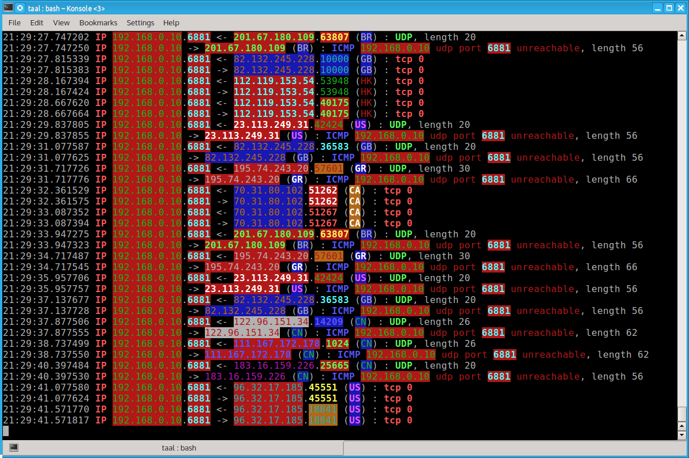
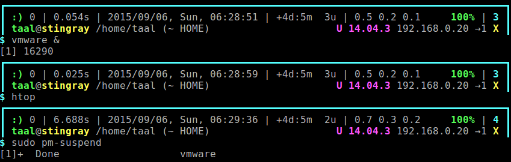

scripts
=======

My collection of scripts. The ones that I'm particularly fond of have screenshots:

How the scripts works: First it collects your local ip4/6 and MAC addresses.
When they occur in the tcpdump output they are placed on the left. All ip
addresses and port numbers are hashed and given a color according to the
hash value. This way the same ip or port number always has the same color
in the output, making output more easy to interpret. All non-local ips
are also checked for country code, which is suffixed in the output. This
would allow you to quickly see if $rogue_nation is mounting an attack on
your network perimeter.

My prompt has evolved over time to show the following, from start to finish,
items between ()'s optional: Last command's exitcode, prefixed by a happy
smiley if 0, or sad red smiley if not 0. Execution time of the last command.
Full date and time. System uptime, load. (Battery charges of attached 
batteries, color coded, green: A/C or charging. Yellow: discharging. Red: if 
charge is low) (Number of VMs detected running.). Username at host. User is
red if root, green otherwise. Hostname is yellow if physical, cyan if a VM.
Current directory. Linux distribution detected. Active ips detected with an 
arrow indicating the default gateway.

That's about it. I have researched byobu but the complexity of setting it up
put me off using it. My crude but effective bashrc suffices for now :)
